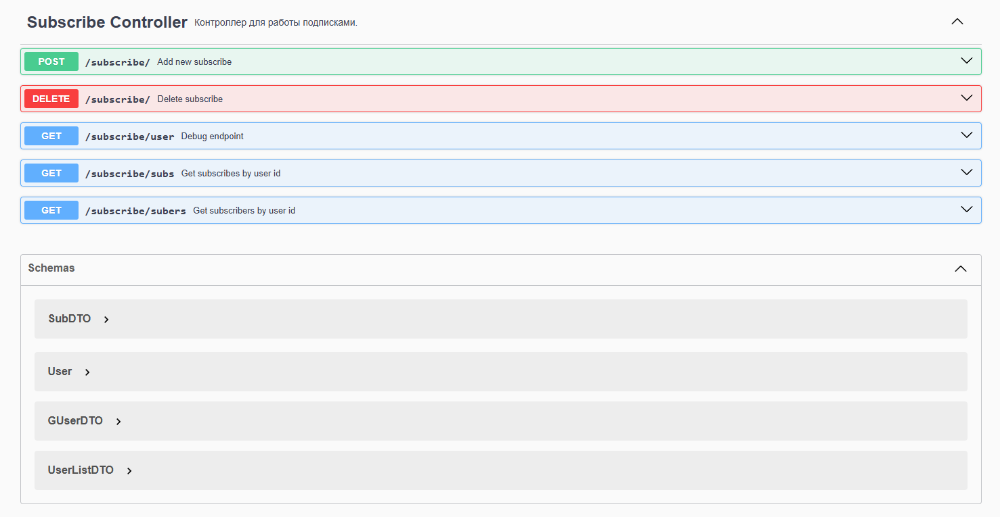

# Links Management Service (Link_MS-X3)
Микросервис для управления пользователями учетными записями пользователей и их подписками.


## Содержание
- [Особености](#особенности)
- [Технологический стек](#технологический-стек)
- [Требования](#требования)
- [Установка и запуск](#установка-и-запуск)
- [API Endpoints](#api-endpoints)
- [Примеры запросов](#примеры-запросов)
- [Тестирование](#тестирование)
- [Структура проекта](#структура-проекта)

## Особенности
- Управление подписками между пользователями
- Валидация данных и обработка ошибок
- Контейнеризация с Docker
- Интеграция с базой данных Neo4j
- OpenAPI документация

## Технологический стек
- **Язык**: Java 23
- **Фреймворк**: Spring Boot 3.1
- **База данных**: Neo4j
- **Библиотеки**:
    - Spring Data JPA
    - Lombok
    - MapStruct
- **Инструменты**:
    - Docker
    - Maven
    - OpenAPI 3.0

## Требования
- Java 23+
- Maven 3.8+
- Docker 20.10+
- PostgreSQL 17+

## Установка и запуск

### 1. Клонирование репозитория
```bash
git clone https://github.com/ender019/Link_MS-X3.git
cd Link_MS-X3
```
### 2. Запуск с Docker
```bash
docker-compose build --no-cache && docker-compose up
```

## API Endpoints
Документация доступна после запуска: http://localhost:8082/link/swagger.html

### Основные методы:


## Примеры запросов
### Регистрация пользователя
```bash
curl -X POST http://localhost:8082/link/subscribe \
  -H "Content-Type: application/json" \
  -d '{
       "user_id": "string",
       "sub_id": "string"
     }'
```

### Получение подписок пользователя
```bash
curl -X DELETE http://localhost:8082/link/subs
```

## Тестирование
### Тестовое покрытие:

- #### Unit-тесты: сервисы, мапперы
- #### Интеграционные тесты: контроллеры, сервисы

### Запуск тестов

```bash
mvn test
```

## Структура проекта
```
src/
└── main/
    ├── java/
    │   ├── com/
    │   │   └── unknown/
    │   │       ├── advices/      # REST контроллеры
    │   │       ├── controllers/  # REST контроллеры
    │   │       ├── models/       # Сущности БД
    │   │       ├── repositories/ # Интерфейсы JPA
    │   │       ├── schemas/      # Data Transfer Objects
    │   │       └── services/     # Бизнес-логика
    │   └── resources/            # Конфиги и миграции
    └── test/                     # Тесты
```
